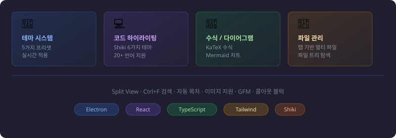
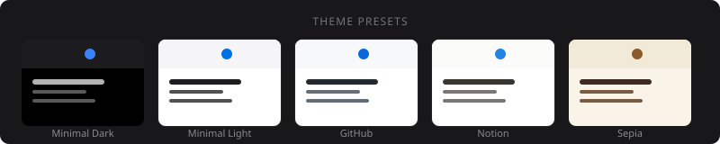
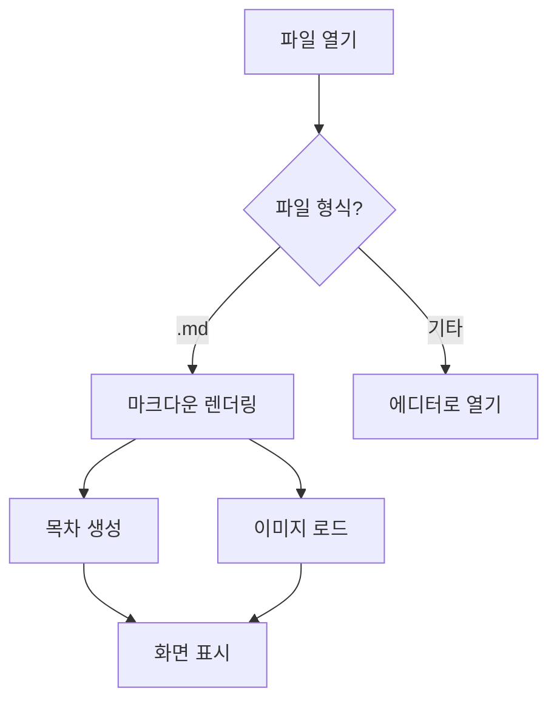
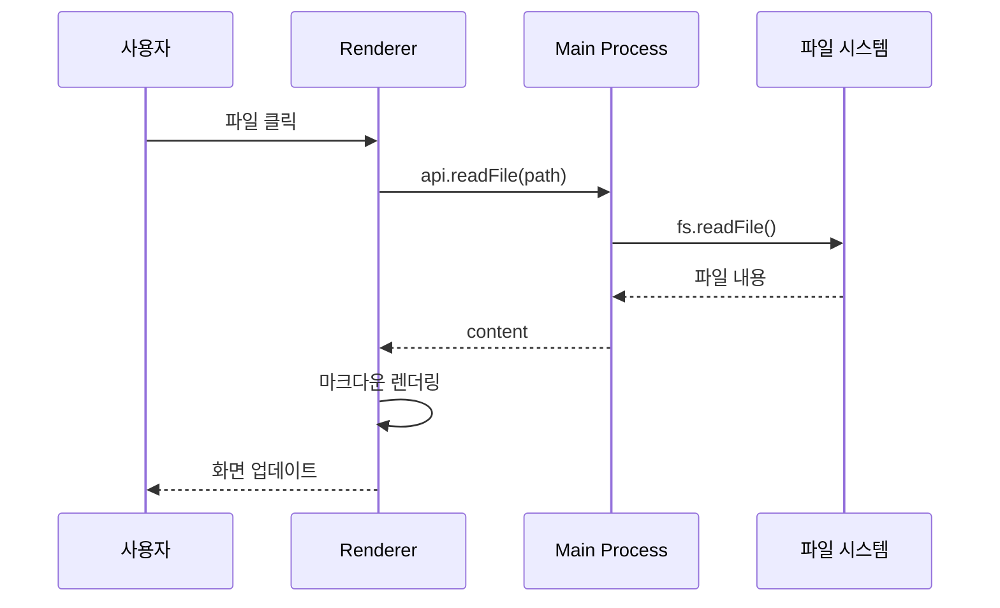
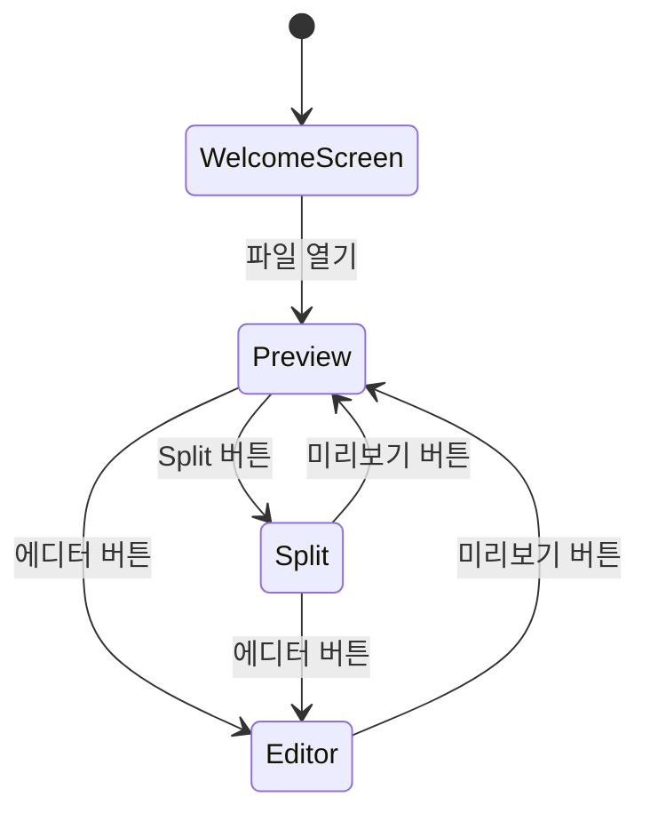

# MD Viewer 샘플 문서


이 문서는 MD Viewer에서 지원하는 **마크다운 요소**를 한눈에 볼 수 있는 샘플입니다.

- 내부 파일 링크: [linked.md 열기](./linked.md)
- 앵커 링크: [수식 섹션으로 이동](#수식--katex)

---

## 주요 기능 소개



---

## 테마 프리셋



설정 패널(우측 상단 버튼)에서 위 5가지 테마를 실시간으로 전환할 수 있습니다.

---

## 텍스트 서식

일반 본문 텍스트입니다. **굵게(Bold)** 와 *기울임(Italic)* 을 함께 쓸 수 있고, ~~취소선~~ 도 됩니다.  
`인라인 코드`는 이렇게 표시됩니다.

강조를 함께 쓰면: ***굵고 기울임*** 도 가능합니다.

---

## 제목 레벨

> 설정 패널에서 각 제목 스타일을 변경해보세요.

### H3 제목 (◆ / ▸ / ● 프리픽스 선택 가능)

#### H4 제목

##### H5 소제목

###### H6 소제목

---

## 목록

### 순서 없는 목록

- 첫 번째 항목
- 두 번째 항목
  - 중첩 항목 1
  - 중첩 항목 2
    - 3단계 중첩
- 세 번째 항목

### 순서 있는 목록

1. 첫 번째
2. 두 번째
3. 세 번째
   1. 하위 항목
   2. 하위 항목

### 체크박스 목록

- [x] 테마 시스템 구현
- [x] 코드 하이라이팅
- [x] 수식 렌더링 (KaTeX)
- [x] Mermaid 다이어그램
- [x] 이미지 지원
- [ ] 집중 모드
- [ ] PDF 내보내기
- [ ] 글로벌 검색

---

## 인용문 / 콜아웃

일반 인용문:

> 콘텐츠가 주인공이어야 한다.  
> UI는 최대한 뒤로 빠지고, 글이 돋보여야 한다.

콜아웃 블럭 (`blockquote` 스타일을 **콜아웃 감지**로 변경하면 아래처럼 표시됩니다):

> [!NOTE]
> `rehype-slug`로 헤딩에 자동으로 `id`가 부여되어 목차 이동이 가능합니다.

> [!TIP]
> Split 뷰에서 에디터와 뷰어를 동시에 보면서 작성하세요.

> [!WARNING]
> 외부 파일이 변경되면 자동으로 리로드됩니다. 저장하지 않은 내용은 사라집니다.

> [!DANGER]
> 삭제된 파일은 복구할 수 없습니다.

> [!INFO]
> 이미지는 마크다운 파일 기준 상대 경로로 참조할 수 있습니다.

> [!CAUTION]
> 큰 Mermaid 다이어그램은 렌더링 시간이 걸릴 수 있습니다.

---

## 표

### 기본 표 (default)

| 이름 | 역할 | 상태 |
|------|------|------|
| Electron | 데스크탑 앱 프레임워크 | ✅ 사용 중 |
| React | UI 라이브러리 | ✅ 사용 중 |
| Shiki | 코드 하이라이터 | ✅ 사용 중 |
| KaTeX | 수식 렌더러 | ✅ 사용 중 |

> 설정에서 표 스타일을 **스타일 표**로 바꾸면 그라디언트 헤더 + 둥근 모서리로 표시됩니다.

---

## 코드 블록

### JavaScript

```javascript
async function loadMarkdown(filePath) {
  const content = await window.api.readFile(filePath)
  return content
}
```

### TypeScript

```typescript
interface UserSettings {
  activePreset: ThemePresetId
  fontSize: number
  contentWidth: number
  lineHeight: number
}

function applyTheme(settings: UserSettings): void {
  document.documentElement.style.setProperty(
    '--font-size-body',
    `${settings.fontSize}px`
  )
}
```

### Python

```python
def parse_frontmatter(content: str) -> dict:
    """마크다운 프론트매터 파싱"""
    if not content.startswith('---'):
        return {}
    end = content.find('---', 3)
    if end == -1:
        return {}
    return yaml.safe_load(content[3:end])
```

### CSS

```css
.prose {
  color: var(--prose-body);
  font-family: var(--font-body);
  max-width: var(--content-width);
}

.prose h1 {
  color: var(--prose-heading);
  font-size: 1.75rem;
  font-weight: 700;
}
```

### Bash

```bash
# 개발 서버 실행
npm run dev

# Windows 패키징
npm run package:win
```

---

## 수식 (KaTeX)

인라인 수식: $E = mc^2$, $\pi \approx 3.14159$

블록 수식:

$$
\int_{-\infty}^{\infty} e^{-x^2} dx = \sqrt{\pi}
$$

$$
\sum_{n=1}^{\infty} \frac{1}{n^2} = \frac{\pi^2}{6}
$$

행렬:

$$
\begin{pmatrix}
a & b \\
c & d
\end{pmatrix}
\begin{pmatrix}
x \\
y
\end{pmatrix}
=
\begin{pmatrix}
ax + by \\
cx + dy
\end{pmatrix}
$$

---

## Mermaid 다이어그램

### 플로우차트



### 시퀀스 다이어그램



### 상태 다이어그램



---

## 링크

- [프로젝트 개요](./overview.md) — 내부 문서 링크
- [아키텍처](./architecture.md)
- [컴포넌트](./components.md)
- [테마 시스템](./theming.md)

---

## 이미지

이미지는 마크다운 파일 위치 기준 상대 경로로 참조합니다.

```markdown


```

설정 패널에서 이미지 스타일을 **그림자 + 캡션**으로 변경하면 alt 텍스트가 캡션으로 표시됩니다.


---

## 인라인 HTML (webview)

` ```html ` 코드 블록은 완전한 브라우저 환경(webview)으로 렌더링됩니다. JavaScript가 실행됩니다.

### 카운터

```html
<!DOCTYPE html>
<html>
<head>
<style>
  body { margin: 16px; font-family: system-ui, sans-serif; background: transparent; }
  .counter { display: flex; align-items: center; gap: 16px; }
  button {
    width: 36px; height: 36px; border-radius: 8px; border: none;
    background: #3b82f6; color: white; font-size: 1.2rem; cursor: pointer;
  }
  button:hover { background: #2563eb; }
  #count { font-size: 2rem; font-weight: 700; min-width: 48px; text-align: center; }
</style>
</head>
<body>
  <div class="counter">
    <button onclick="update(-1)">−</button>
    <span id="count">0</span>
    <button onclick="update(1)">+</button>
  </div>
  <script>
    let n = 0
    function update(d) {
      n += d
      document.getElementById('count').textContent = n
    }
  </script>
</body>
</html>
```

### Canvas 애니메이션

```html
<!DOCTYPE html>
<html>
<head>
<style>
  body { margin: 0; background: #0f0f1a; display: flex; justify-content: center; }
  canvas { display: block; }
</style>
</head>
<body>
<canvas id="c" width="600" height="160"></canvas>
<script>
  const canvas = document.getElementById('c')
  const ctx = canvas.getContext('2d')
  const particles = Array.from({ length: 60 }, () => ({
    x: Math.random() * 600, y: Math.random() * 160,
    r: Math.random() * 2 + 1,
    dx: (Math.random() - 0.5) * 1.2,
    dy: (Math.random() - 0.5) * 1.2,
    hue: Math.random() * 60 + 200
  }))
  function draw() {
    ctx.fillStyle = 'rgba(15,15,26,0.2)'
    ctx.fillRect(0, 0, 600, 160)
    particles.forEach(p => {
      ctx.beginPath()
      ctx.arc(p.x, p.y, p.r, 0, Math.PI * 2)
      ctx.fillStyle = `hsla(${p.hue},80%,70%,0.8)`
      ctx.fill()
      p.x += p.dx; p.y += p.dy
      if (p.x < 0 || p.x > 600) p.dx *= -1
      if (p.y < 0 || p.y > 160) p.dy *= -1
    })
    requestAnimationFrame(draw)
  }
  draw()
</script>
</body>
</html>
```

### 외부 HTML 파일 참조

코드 블록 내용이 `.html` 경로 한 줄이면 파일을 읽어서 렌더링합니다.

```html
./counter.html
```

---

## 각주

마크다운 본문에 각주[^fn1]를 달 수 있습니다. 여러 개도 가능합니다[^fn2].

긴 내용도 지원합니다[^fn3].

[^fn1]: 첫 번째 각주입니다.
[^fn2]: 두 번째 각주 — 클릭하면 본문으로 돌아갑니다.
[^fn3]: 각주에는 **굵게**, *기울임* 등 인라인 마크다운을 쓸 수 있습니다.

---

## 구분선

기본 구분선:

---

설정에서 구분선 스타일을 **✦ ✦ ✦ 장식**으로 변경하면 아래처럼 됩니다.
